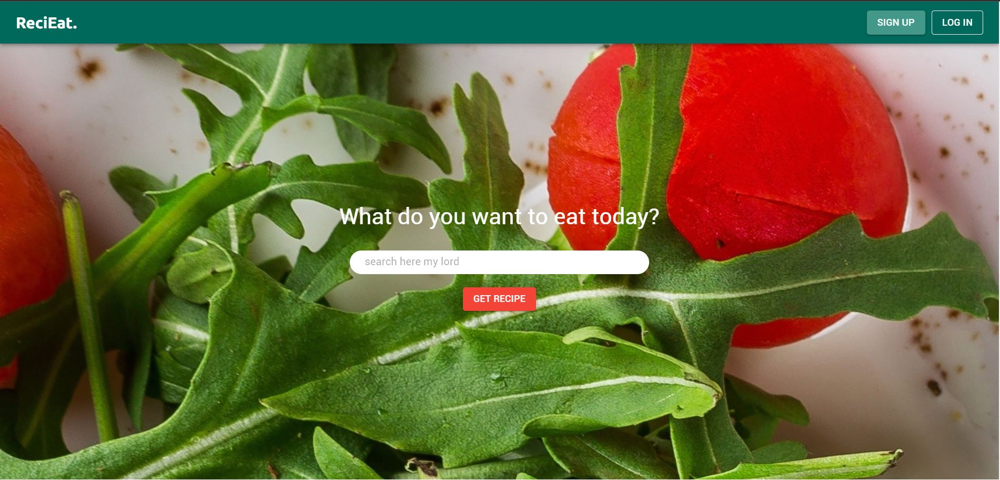
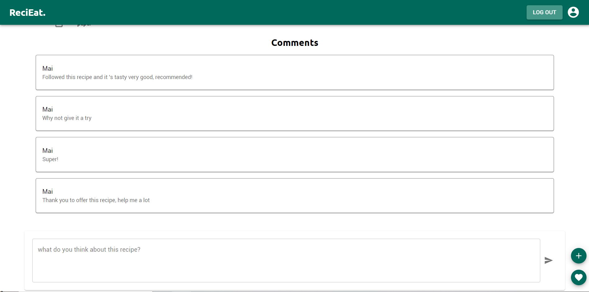

  # **Introduce:**  
  
  ## Website: https://lively-puffpuff-0efced.netlify.app/

ReciEat is a recipe website where user can search, add the recipes. This project is made in 2 weeks and it is the first project that I use TypeScript, Redux toolkit and Material UI, so that some features I didn't have time to implementing yet and will work on it in the future.

### Some main features that ReciEat has:

    - User can get some random recipe by send some keywords
    - User can comment and give like to the recipe
    - User can log in and sign up
    - User can add their own recipe to the website

The server is made with PostgreSQL, NodeJs and Express
Source code of the server you can find here: https://github.com/MaiBach22/ReciEat_Server

The server is deployed by using Heroku
The website is deployed by using Netlify
    
 ### Future of the app:
   - User can edit/ delete their recipe
   - User can add save the recipes that they like
   
    
***
# Tools:

Front End : 
 + React 
 + Redux toolkit 
 + Typescript 
 + Axios
 + Material UI

Back End : 
+  Sequelize 
+  Postgres 
+  Expressjs
+  Nodejs

# Data Tables :

# Wireframe :

# ScreenShot:

